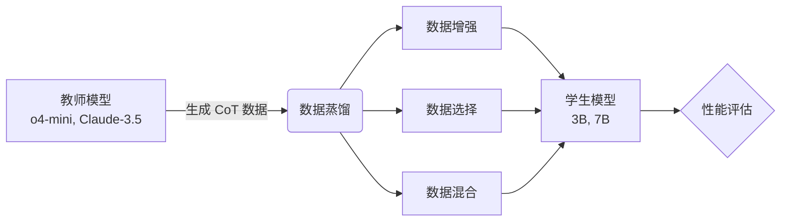
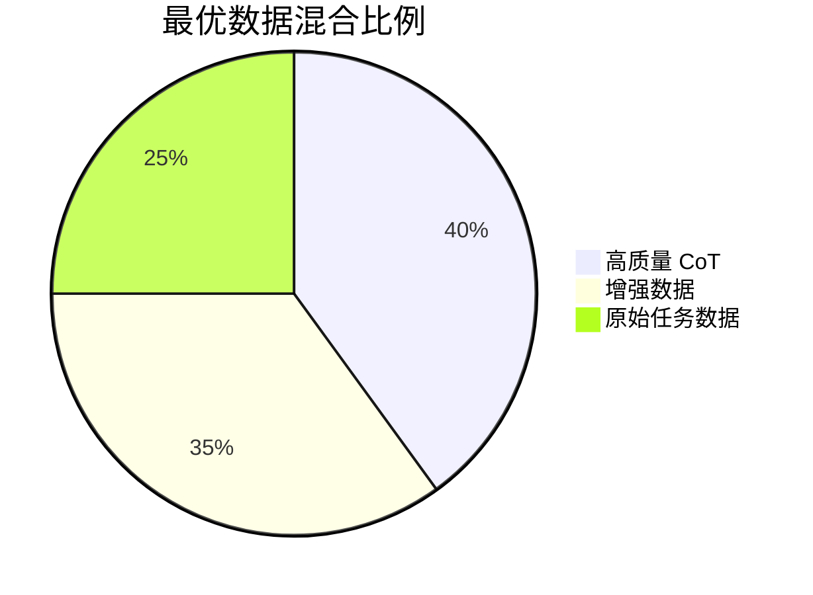

> **论文信息**
> - **标题**: The Quest for Efficient Reasoning: A Data-Centric Benchmark to CoT Distillation
> - **作者**: Ruichen Zhang et al. (UNITES Lab)
> - **arXiv**: [2505.18759](https://arxiv.org/abs/2505.18759)
> - **代码**: [GitHub - UNITES-Lab/Distillation-Bench](https://github.com/UNITES-Lab/Distillation-Bench)

---

## 📋 摘要

数据为中心的蒸馏方法（包括数据增强、选择和混合）为创建更小、更高效的学生大语言模型提供了一条有前景的路径，同时保留强大的推理能力。然而，目前仍缺乏一个全面的基准来系统评估每种蒸馏方法的效果。

本文介绍了 **DC-CoT**，这是首个以数据为中心的基准，从**方法**、**模型**和**数据**三个视角系统研究思维链（CoT）蒸馏中的数据操作技术。

---

## 🎯 研究动机

### 背景

随着大语言模型（LLM）的快速发展，如何在保持推理能力的同时降低模型规模成为一个关键问题。数据为中心的蒸馏方法应运而生：



### 核心问题

1. **缺乏系统评估**：现有研究缺乏对蒸馏方法的全面对比
2. **泛化能力不明**：IID（同分布）和 OOD（异分布）场景下的表现如何？
3. **最佳实践缺失**：如何优化数据蒸馏策略？

---

## 🔬 研究方法

### DC-CoT 基准框架

DC-CoT 从三个维度进行评估：

| 维度 | 评估内容 | 具体项目 |
|------|---------|---------|
| **方法视角** | 不同蒸馏技术对比 | 数据增强、选择、混合 |
| **模型视角** | 教师 - 学生架构影响 | o4-mini → 3B/7B, Claude-3.5 → 3B/7B |
| **数据视角** | 数据集泛化能力 | IID, OOD, 跨域迁移 |

### 实验设置

**教师模型**：
- o4-mini（OpenAI）
- Gemini-Pro（Google）
- Claude-3.5（Anthropic）

**学生模型**：
- 3B 参数量级
- 7B 参数量级

**评估数据集**：
- 数学推理
- 逻辑推理
- 常识推理
- 跨领域任务

---

## 📊 核心发现

### 1. 数据增强效果显著

```
原始 CoT 数据 → 数据增强 → 性能提升 +15-25%
```

- **增强策略**： paraphrasing、难度分级、多样化表达
- **最佳场景**：数学推理任务提升最明显

### 2. 数据选择至关重要

不是所有教师生成的数据都有价值：

- **高质量筛选**：保留 top-30% 数据可达到全量数据的 90% 性能
- **多样性优先**：避免重复模式，提升泛化能力

### 3. 混合策略的平衡



### 4. 泛化能力对比

| 场景 | 性能保持率 | 关键因素 |
|------|----------|---------|
| **IID**（同分布） | 95-100% | 数据质量 |
| **OOD**（异分布） | 70-85% | 数据多样性 |
| **跨域迁移** | 60-75% | 任务相关性 |

---

## 💡 实践建议

基于实验结果，作者提出以下最佳实践：

### ✅ 推荐做法

1. **优先数据质量**：使用强教师模型生成初始 CoT
2. **适度增强**：2-3 倍增强率效果最佳
3. **多样性筛选**：避免模式坍塌
4. **分层训练**：先 IID 后 OOD 数据

### ⚠️ 避免陷阱

1. ❌ 盲目增加数据量（边际效益递减）
2. ❌ 单一教师模型（泛化能力受限）
3. ❌ 忽视数据分布（OOD 性能下降）

---

## 🔍 个人思考

### 研究价值

1. **填补空白**：首个系统性的 CoT 蒸馏基准
2. **实用性强**：提供了可操作的最佳实践
3. **开源贡献**：代码和数据集公开，便于复现

### 局限性

1. **教师模型有限**：未包含更多开源模型（如 LLaMA 系列）
2. **评估维度**：缺少推理速度和资源消耗的对比
3. **长期效果**：未评估模型在持续学习中的表现

### 启发与延伸

对于个人博客和技术实践，这篇论文给了我以下启发：

- **数据质量 > 数据数量**：在训练个人助手时，精心筛选的数据比大量低质数据更有效
- **多样性是关键**：避免过拟合单一模式，提升泛化能力
- **系统评估的重要性**：建立自己的评估基准，而非依赖单一指标

---

## 📚 相关阅读

- [Chain-of-Thought Prompting](https://arxiv.org/abs/2201.11903) - Wei et al. 2022
- [Distillation Survey](https://arxiv.org/abs/2006.05525) - Gou et al. 2020
- [Data-Centric AI](https://www.deeplearning.ai/the-batch/how-data-centric-ai-is-changing-the-game/) - Andrew Ng

---

## 📝 总结

DC-CoT 基准为数据为中心的思维链蒸馏研究提供了系统性评估框架。核心贡献在于：

1. **首次全面对比**不同蒸馏策略的效果
2. **揭示关键因素**：数据质量、多样性、混合比例
3. **提供实践指南**：帮助研究者优化蒸馏流程

对于希望构建高效推理模型的研究者和工程师，这篇论文提供了宝贵的参考。

---

*最后更新：2026-03-26*
