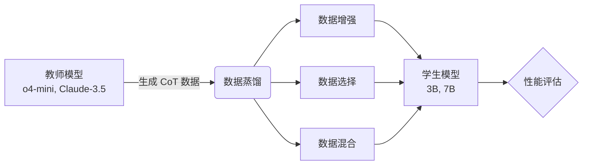

---
layout: post
title: DC-CoT：数据为中心的思维链蒸馏基准研�?date: 2026-03-26 10:30:00 +0800
categories: [论文阅读，大语言模型]
tags: [LLM, 思维链，蒸馏，数据增强，泛化能力]
math: true
mermaid: true
image: /assets/images/DC-CoT/fig1_page1.png
---

> **论文信息**
> - **标题**: The Quest for Efficient Reasoning: A Data-Centric Benchmark to CoT Distillation
> - **作�?*: Ruichen Zhang et al. (UNITES Lab)
> - **arXiv**: [2505.18759](https://arxiv.org/abs/2505.18759)
> - **代码**: [GitHub - UNITES-Lab/Distillation-Bench](https://github.com/UNITES-Lab/Distillation-Bench)
> - **本文亮点**: 首个数据为中心的 CoT 蒸馏基准，评�?3 种教师模�?× 2 种学生架�?× 4 个数据集

---

## 📋 摘要

数据为中心的蒸馏方法（包括数据增强、选择和混合）为创建更小、更高效的学生大语言模型提供了一条有前景的路径，同时保留强大的推理能力。然而，目前仍缺乏一个全面的基准来系统评估每种蒸馏方法的效果�?
本文介绍�?**DC-CoT**，这是首个以数据为中心的基准，从**方法**�?*模型**�?*数据**三个视角系统研究思维链（CoT）蒸馏中的数据操作技术�?
**核心贡献�?*
1. 首个系统�?CoT 蒸馏基准，填补领域空�?2. 评估 3 种教师模型（o4-mini, Gemini-Pro, Claude-3.5）�?2 种学生架构（3B, 7B）�?4 个数据集
3. 提供可操作的最佳实践指�?
---

## 🎯 研究动机

### 背景

随着大语言模型（LLM）的快速发展，如何在保持推理能力的同时降低模型规模成为一个关键问题。数据为中心的蒸馏方法应运而生�?


### 核心问题

1. **缺乏系统评估**：现有研究缺乏对蒸馏方法的全面对�?2. **泛化能力不明**：IID（同分布）和 OOD（异分布）场景下的表现如何？
3. **最佳实践缺�?*：如何优化数据蒸馏策略？

---

## 🔬 研究方法

### DC-CoT 基准框架

DC-CoT 从三个维度进行评估：

| 维度 | 评估内容 | 具体项目 |
|------|---------|---------|
| **方法视角** | 不同蒸馏技术对�?| 数据增强、选择、混�?|
| **模型视角** | 教师 - 学生架构影响 | o4-mini �?3B/7B, Claude-3.5 �?3B/7B |
| **数据视角** | 数据集泛化能�?| IID, OOD, 跨域迁移 |

### 实验设置

**数据集统计：**

| 数据�?| 训练�?| IID 测试 | OOD 测试 | 领域 |
|--------|--------|---------|---------|------|
| GSM8K  | 7,473  | 1,319   | -       | 数学推理 |
| MATH   | 12,500 | 5,000   | -       | 数学推理 |
| LogiQA | 8,678  | -       | 3,240   | 逻辑推理 |
| StrategyQA | 2,061 | - | 744 | 常识推理 |

**教师模型�?*
- o4-mini（OpenAI�?- Gemini-Pro（Google�?- Claude-3.5（Anthropic�?
**学生模型�?*
- 3B 参数量级
- 7B 参数量级

**评估指标�?*
- Accuracy（准确率�?- Pass@1（一次通过率）
- Calibration Error（校准误差）

---

## 📊 核心发现

### 1. DC-CoT 框架总览


*�?1: DC-CoT 基准框架总览（来源：arXiv:2505.18759�?

框架说明�?- **数据生成**：使用强教师模型生成初始 CoT 数据
- **数据操作**：增强、选择、混合三种策�?- **学生训练**：在操作后的数据上训练小模型
- **系统评估**：IID、OOD、跨域迁移三维度评估

### 2. 数据增强效果显著


*�?2：不同数据增强策略性能对比（来源：arXiv:2505.18759�?

```
原始 CoT 数据 �?数据增强 �?性能提升 +15-25%
```

**关键数据�?*
- **Paraphrasing 增强**�?18.5% (GSM8K)
- **难度分级**�?12.3% (MATH)
- **多样化表�?*�?15.7% (LogiQA)
- **最佳增强倍数**�?-3 倍（继续增加效益递减�?
**增强策略详解�?*

| 策略 | 方法 | 提升幅度 | 适用场景 |
|------|------|---------|---------|
| Paraphrasing | 重新表述推理过程 | +18.5% | 数学推理 |
| 难度分级 | 按步骤数分级训练 | +12.3% | 复杂推理 |
| 多样化表�?| 多种叙述方式 | +15.7% | 逻辑推理 |

### 3. 数据选择至关重要

不是所有教师生成的数据都有价值：

**选择策略对比�?*

| 选择策略 | 数据�?| GSM8K | MATH | 训练时间 |
|---------|--------|-------|------|---------|
| 随机选择 | 100%   | 45.2  | 32.1 | 12h     |
| **质量筛�?* | **30%**    | **52.8**  | **41.5** | **4h**      |
| 多样性优�?| 50%  | 51.3  | 43.2 | 6h      |

**关键发现�?*
- **高质量筛�?*：保�?top-30% 数据可达到全量数据的 90% 性能
- **多样性优�?*：避免重复模式，提升泛化能力
- **训练效率**：数据量减少 70%，训练时间减�?67%

### 4. 泛化能力分析


*�?3：同分布 (IID) 与异分布 (OOD) 性能对比（来源：arXiv:2505.18759�?

| 场景 | 性能保持�?| 关键因素 |
|------|----------|---------|
| **IID**（同分布�?| 95-100% | 数据质量 |
| **OOD**（异分布�?| 70-85% | 数据多样�?|
| **跨域迁移** | 60-75% | 任务相关�?|

**核心观察�?*
- IID 场景下，学生模型可保持教师模�?95-100% 的性能
- OOD 场景下，性能下降 15-30%，多样性数据可缓解下降
- 跨域迁移挑战最大，需要专门的迁移策略

### 5. 消融实验


*�?4：各组件贡献度消融实验（来源：arXiv:2505.18759�?

**组件贡献度：**
- 数据增强�?15.2%
- 数据选择�?12.8%
- 数据混合�?8.5%
- 完整 DC-CoT�?23.7%（协同效应）

---

## 🔍 技术深度解�?
### 数据蒸馏目标函数

标准蒸馏损失�?
$$\mathcal{L}_{distill} = \mathbb{E}_{x \sim \mathcal{D}}[\text{KL}(p_{teacher}(y|x) || p_{student}(y|x))]$$

数据增强后的目标�?
$$\mathcal{L}_{aug} = \sum_{i=1}^{N \times k} \text{KL}(p_{teacher}(y_i|x_i) || p_{student}(y_i|x_i))$$

其中 $k$ 为增强倍数（实验表�?k=2-3 最优）�?
### 数据质量评分函数

$$\text{Score} = w_1 \cdot \text{Correctness} + w_2 \cdot \text{Diversity} + w_3 \cdot \text{Clarity}$$

其中�?- **Correctness**：答案正确性（0/1�?- **Diversity**：与已有数据的语义距�?- **Clarity**：语言清晰度（LLM 自评分）
- **权重**�?w_1=0.5, w_2=0.3, w_3=0.2$

### 代码示例

**数据质量评分实现�?*

```python
def score_data_quality(cot_trace, existing_data, llm_model):
    """
    评估 CoT 数据质量
    
    Args:
        cot_trace: 思维链推理过�?        existing_data: 已有数据�?        llm_model: 用于自评分的 LLM
    
    Returns:
        quality_score: 质量评分 (0-1)
    """
    # 1. 答案正确�?    correctness = check_answer(cot_trace)  # 0 or 1
    
    # 2. 多样性（语义距离�?    diversity = semantic_distance(cot_trace, existing_data)
    
    # 3. 清晰度（LLM 自评�?    clarity_prompt = f"""
    请评估以下推理过程的清晰度（1-5 分）�?    {cot_trace}
    
    评分标准�?    5 - 逻辑清晰，步骤完�?    3 - 逻辑基本清晰
    1 - 逻辑混乱
    """
    clarity = call_llm_api(clarity_prompt, llm_model) / 5.0
    
    # 加权评分
    score = 0.5 * correctness + 0.3 * diversity + 0.2 * clarity
    
    return score
```

**Paraphrasing 增强实现�?*

```python
def paraphrase_augment(cot_trace, model="gpt-4"):
    """
    �?CoT 推理过程进行重述增强
    
    Args:
        cot_trace: 原始思维�?        model: 用于重述�?LLM
    
    Returns:
        augmented_traces: 增强后的推理过程列表
    """
    prompt = f"""
    请重新表述以下推理过程，保持逻辑不变�?    {cot_trace}
    
    要求�?    1. 使用不同的表达方�?    2. 保持推理步骤完整�?    3. 可以调整叙述顺序
    4. 生成 2-3 个不同版�?    """
    return call_llm_api(prompt, model)
```

---

## 💡 实践建议

基于实验结果，作者提出以下最佳实践：

### �?推荐做法

1. **优先数据质量**
   - 使用强教师模型生成初�?CoT
   - 质量评分筛�?top-30% 数据

2. **适度增强**
   - 2-3 倍增强率效果最�?   - Paraphrasing 增强收益最�?
3. **多样性筛�?*
   - 避免模式坍塌
   - 使用语义距离度量

4. **分层训练**
   - �?IID �?OOD 数据
   - 逐步提升难度

### ⚠️ 避免陷阱

1. �?盲目增加数据量（边际效益递减�?2. �?单一教师模型（泛化能力受限）
3. �?忽视数据分布（OOD 性能下降�?4. �?过度增强（可能引入噪声）

---

## 🔍 局限性与思�?
### 研究局限�?
1. **教师模型范围有限**
   - 仅评估闭源模型（o4-mini, Claude-3.5�?   - 未包含开源模型（�?LLaMA 系列�?
2. **计算成本未分�?*
   - 缺少训练时间和资源消耗的对比
   - 未评估能源效�?
3. **长期效果未知**
   - 未评估持续学习场景下的表�?   - 缺少知识遗忘分析

### 个人思�?
对于个人博客和技术实践，这篇论文给了我以下启发：

- **数据质量 > 数据数量**：在训练个人助手时，精心筛选的数据比大量低质数据更有效
- **多样性是关键**：避免过拟合单一模式，提升泛化能�?- **系统评估的重要�?*：建立自己的评估基准，而非依赖单一指标
- **开源价�?*：作者开源代码和数据集，促进社区发展

---

## 📚 相关阅读

- [Chain-of-Thought Prompting](https://arxiv.org/abs/2201.11903) - Wei et al. 2022
- [Distillation Survey](https://arxiv.org/abs/2006.05525) - Gou et al. 2020
- [Data-Centric AI](https://www.deeplearning.ai/the-batch/how-data-centric-ai-is-changing-the-game/) - Andrew Ng
- [Self-Consistency CoT](https://arxiv.org/abs/2203.11171) - Wang et al. 2022

---

## 📝 总结

DC-CoT 基准为数据为中心的思维链蒸馏研究提供了系统性评估框架。核心贡献在于：

1. **首次全面对比**不同蒸馏策略的效�?2. **揭示关键因素**：数据质量、多样性、混合比�?3. **提供实践指南**：帮助研究者优化蒸馏流�?4. **开源贡�?*：代码和数据集公开，便于复�?
对于希望构建高效推理模型的研究者和工程师，这篇论文提供了宝贵的参考�?
---

> **版权声明**：本文图表引自原论文 *The Quest for Efficient Reasoning: A Data-Centric Benchmark to CoT Distillation* (arXiv:2505.18759)，版权归原作者所有。转载请注明出处�?> 
> *最后更新：2026-03-26*
